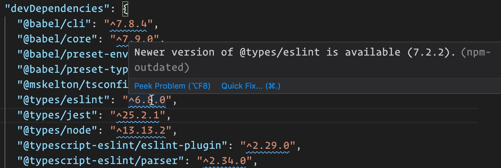

# VS Code npm Outdated

Displays a diagnostic message in package.json files for packages which have newer versions available as well as a code action to quickly update packages to their latest version.

## Usage

This extension provides three primary means of updating outdated packages. The following code actions are available in `package.json` files.

1. `Update all packages` - This command will update all `dependencies` and `devDependencies` in the package.json file.
1. `Update package` - This command will update a single package to the latest version. This will show when a single package is selected.
1. `Update x packages` - This command will update all the selected packages to the latest version. This will show when multiple packages are selected.

## Contributors ✨

Thanks goes to these wonderful people ([emoji key](https://allcontributors.org/docs/en/emoji-key)):

<!-- ALL-CONTRIBUTORS-LIST:START - Do not remove or modify this section -->
<!-- prettier-ignore-start -->
<!-- markdownlint-disable -->
<table>
  <tr>
    <td align="center"><a href="https://github.com/mskelton"> <b>Mark Skelton</b></a> <a href="https://github.com/mskelton/vscode-npm-outdated/commits?author=mskelton" title="Code">💻</a> <a href="#question-mskelton" title="Answering Questions">💬</a> <a href="https://github.com/mskelton/vscode-npm-outdated/commits?author=mskelton" title="Documentation">📖</a> <a href="#ideas-mskelton" title="Ideas, Planning, & Feedback">🤔</a> <a href="#design-mskelton" title="Design">🎨</a></td>
  </tr>
</table>

<!-- markdownlint-enable -->
<!-- prettier-ignore-end -->

<!-- ALL-CONTRIBUTORS-LIST:END -->

This project follows the [all-contributors](https://github.com/all-contributors/all-contributors) specification. Contributions of any kind welcome!
